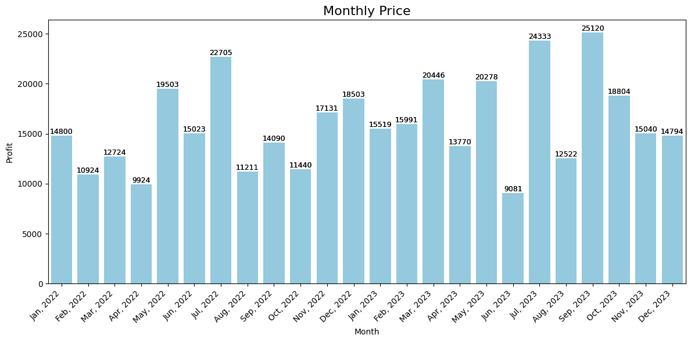
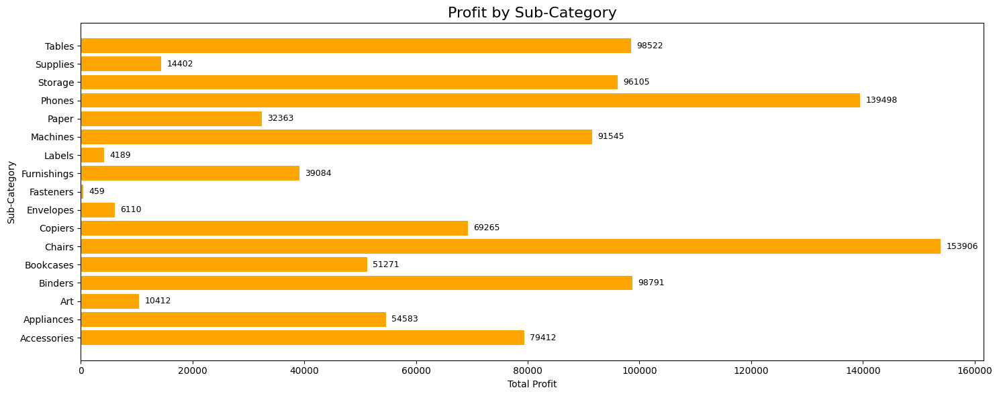
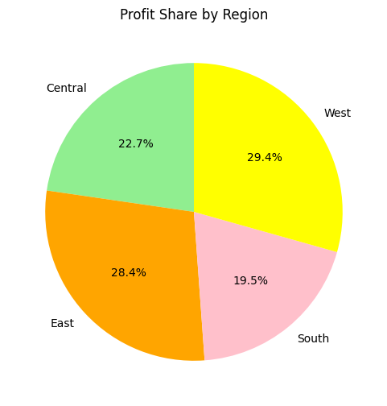
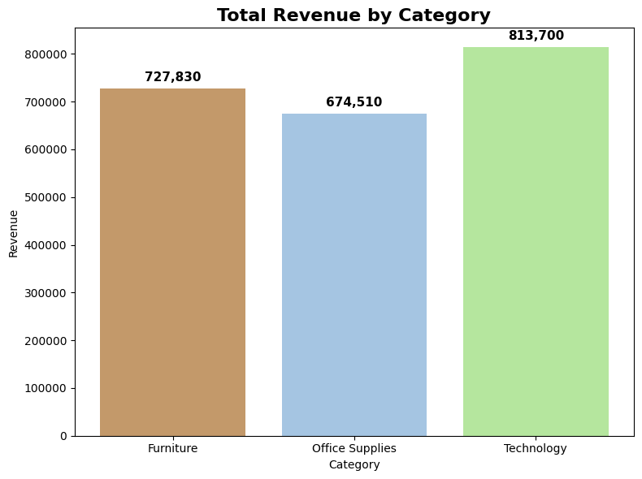
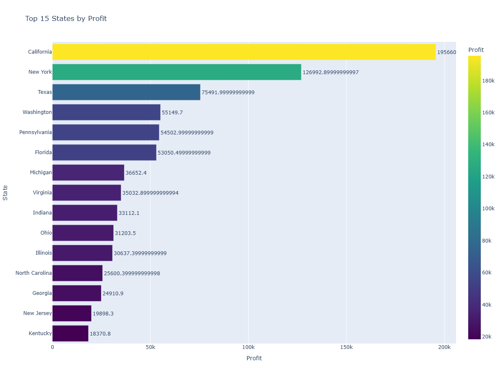

### SalesScope

An end-to-end beginner-friendly Data Analytics Project that transforms raw sales data into meaningful insights.  
This project walks through data cleaning → modeling → KPI analysis → visualization, combining Python libraries (Pandas, Matplotlib, Seaborn) with Power BI dashboards for interactivity.

---

## 🚀 Project Workflow

- **Data Collection**
  - Raw sales dataset (orders, products).
- **Data Preprocessing**
  - Removed duplicates.
  - Handled missing values.
  - Created calculated fields like Revenue, Profit.
- **Exploratory Data Analysis (EDA)**
  - Sales trends over time.
  - Profitability by category/region.
  - Top products.
  - State-wise shipment analysis.
- **KPI Modeling**
  - Revenue
  - Profit

---

## 📊 Visualization  

### 🔹 Python (Matplotlib + Seaborn)  
Static insights from the dataset were visualized using Matplotlib & Seaborn.
 

 

---

### 🔹 Power BI  
Interactive dashboards for dynamic KPI analysis (to be added).
